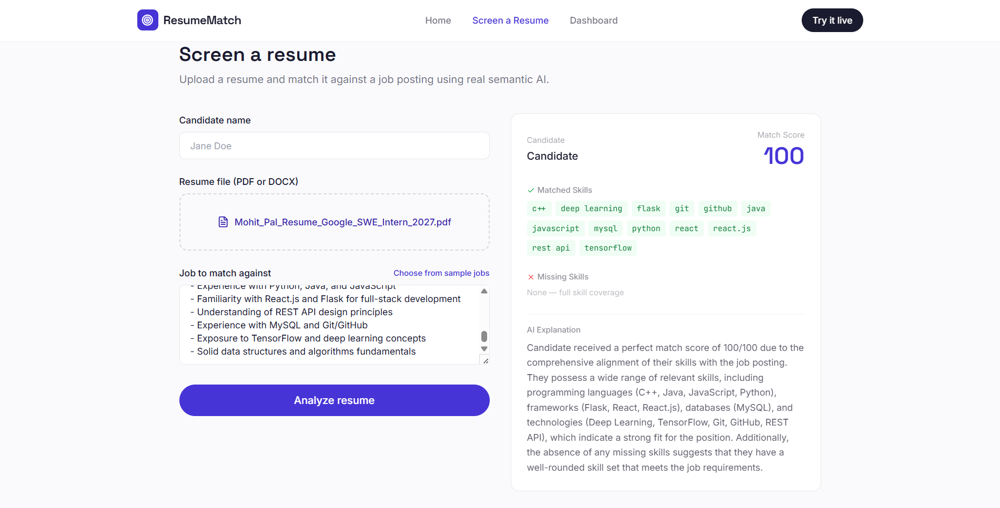
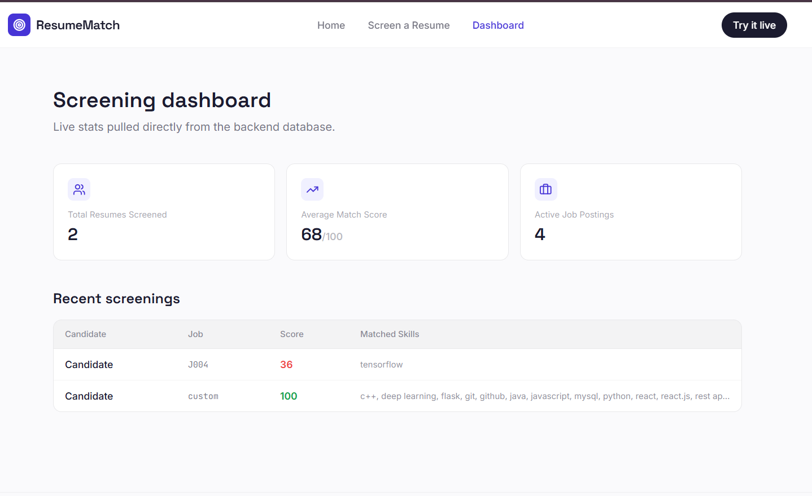
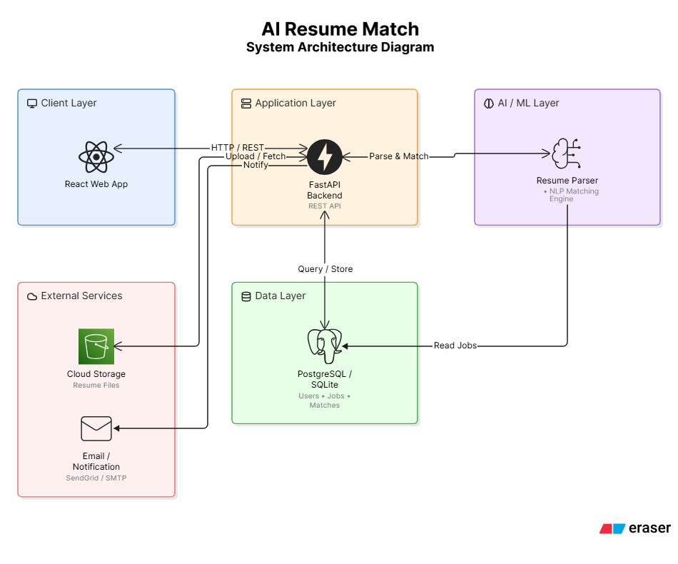
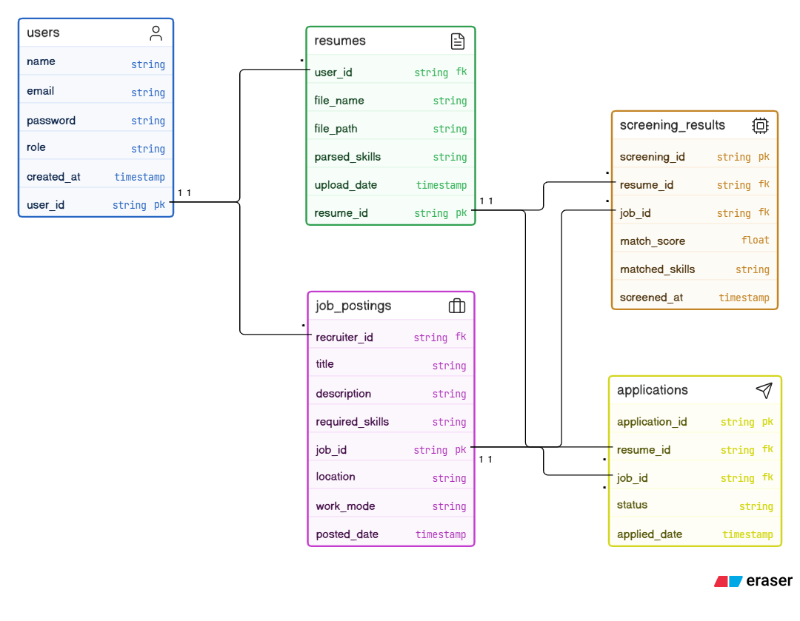

<div align="center">

# 🎯 AI Resume Match

**AI-powered resume screening & job recommendation system, built on a real RAG pipeline.**

Upload a resume, pick a job — a semantic embedding model finds the true overlap,
and a free LLM explains the score in plain English.

[](https://your-vercel-url.vercel.app)
[](https://mohitpal2005-ai-resume-match.hf.space/docs)
[](./LICENSE)

[](https://www.python.org/)
[](https://react.dev/)
[](https://fastapi.tiangolo.com/)
[](https://vitejs.dev/)
[](https://tailwindcss.com/)
[](https://huggingface.co/spaces/mohitpal2005/ai-resume-match)
[](https://vercel.com/)

**[Live App](https://ai-resume-match-olive.vercel.app)** · **[API Docs](https://mohitpal2005-ai-resume-match.hf.space/docs)** · 

</div>

---

## Overview

**AI Resume Match** (formally: *AI Resume Screening & Job Recommendation System*)
is a full-stack application that screens resumes against job postings using
real semantic AI — not keyword regex dressed up as "AI." It's built end-to-end:
a working REST API, an embedding-based matching engine, LLM-generated
explanations, and a production React frontend, all deployed live and free.

## ✨ Features

- 📄 **Real resume parsing** — extracts text from PDF and DOCX resumes
- 🧠 **Semantic matching** — `sentence-transformers` embeddings + cosine similarity, not string matching
- 🔍 **Skill diffing** — automatically surfaces matched vs. missing skills against a job description
- 🤖 **LLM-generated explanations** — a RAG pipeline feeds the retrieved match context to Llama 3 (via Groq) to explain *why* a candidate scored what they did
- 📊 **Live dashboard** — real screening stats pulled from the database, not mock data
- 💼 **Custom or sample job postings** — screen against a preset job or paste your own JD
- 🆓 **Zero-cost stack** — every service used (Hugging Face Spaces, Vercel, Groq free tier) has a genuinely free tier

## 📸 Screenshots

<div align="center">

**Resume screening in action — real semantic match score, skill diffing, and an LLM-generated explanation**


**Live dashboard — real stats pulled from the database, not mock data**


</div>

## 🧬 How it works — the RAG pipeline

```
Resume (PDF/DOCX)  ─┐
                     ├─► Text Extraction ─► sentence-transformers embeddings ─┐
Job Description  ───┘                                                        │
                                                                                ▼
                                                              Cosine Similarity → Match Score
                                                                                │
                                              Skill keyword extraction & diff ◄─┘
                                                                                │
                                                                                ▼
                                              Matched + Missing skills  ──►  Groq LLM (Llama 3)
                                                                                │
                                                                                ▼
                                                          Plain-English explanation of the score
```

1. **Retrieve** — the resume and job description are embedded using
   [`all-MiniLM-L6-v2`](https://huggingface.co/sentence-transformers/all-MiniLM-L6-v2)
   (free, runs on CPU, no API key). Cosine similarity between the two embeddings
   produces the match score — genuine semantic overlap, not exact keyword hits.
2. **Augment** — a curated skill vocabulary is matched against both texts via
   regex to find exactly which skills overlap and which are missing.
3. **Generate** — that retrieved context (score + matched/missing skills) is
   passed to a free LLM (Llama 3 via [Groq](https://console.groq.com)) which
   writes a 2-3 sentence explanation grounded in the actual data. If no
   `GROQ_API_KEY` is configured, a template-based explanation is used instead
   — the app is always fully functional, with or without the LLM key.

### System architecture

<div align="center">

</div>

### Database schema (ER diagram)

<div align="center">

</div>

## 🛠️ Tech stack

| Layer | Technology |
|---|---|
| Frontend | React 18, Vite, Tailwind CSS, React Router, Lucide Icons |
| Backend | FastAPI, Uvicorn |
| AI / ML | sentence-transformers (MiniLM), scikit-learn (cosine similarity), Groq (Llama 3) |
| Parsing | pdfplumber, python-docx |
| Database | SQLite |
| Backend hosting | Hugging Face Spaces (Docker) |
| Frontend hosting | Vercel |

## 📁 Project structure

```
ai-resume-match/
├── backend/
│   ├── app/
│   │   └── main.py           # FastAPI app — all API + AI logic
│   ├── Dockerfile
│   ├── requirements.txt
│   └── README.md             # Hugging Face Spaces config
├── frontend/
│   ├── src/
│   │   ├── pages/            # Home, Screen, Dashboard
│   │   ├── components/       # Layout / nav
│   │   └── api.js            # Backend API client
│   ├── vercel.json
│   └── .env.example
└── DEPLOYMENT.md             # Full deployment walkthrough
```

## 🚀 Quick start (local development)

**Backend**
```bash
cd backend
pip install -r requirements.txt
uvicorn app.main:app --reload
# → http://localhost:8000
# → interactive API docs at http://localhost:8000/docs
```

**Frontend**
```bash
cd frontend
npm install
echo "VITE_API_URL=http://localhost:8000" > .env
npm run dev
# → http://localhost:5173
```

## 🌐 API reference

| Method | Endpoint | Description |
|---|---|---|
| `GET` | `/api/jobs` | List all job postings |
| `POST` | `/api/jobs` | Create a new job posting |
| `POST` | `/api/screen` | Upload a resume + job → returns match score, matched/missing skills, AI explanation |
| `GET` | `/api/dashboard` | Aggregate stats + recent screenings |

Full interactive docs (Swagger UI): **`/docs`** on the deployed backend.

## ☁️ Deployment

This app is deployed completely free:
- **Backend** → [Hugging Face Spaces](https://huggingface.co/spaces/mohitpal2005/ai-resume-match) (Docker SDK)
- **Frontend** → [Vercel](https://vercel.com)

See [DEPLOYMENT.md](./DEPLOYMENT.md) for the full step-by-step guide.

## 🗺️ Roadmap

- [ ] User authentication (recruiter vs. job seeker roles)
- [ ] Batch resume upload (screen multiple candidates at once)
- [ ] Persistent cloud database (currently SQLite, resets on Space restart)
- [ ] Resume improvement suggestions for job seekers

## 📄 License

MIT — free to use, modify, and learn from.

## 👤 Author

**Mohit Pal**
B.Tech CSE, VIT Bhopal University
